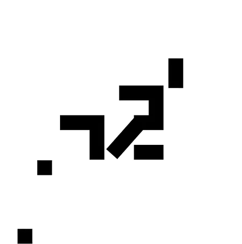

One nice task from Mobile Section of [Yandex Championship 2019](https://yandex.ru/championship/)

## Short Description
In input txt files there are figures and animations that should be applied to them.  
You need to find the text that was rendered via these animations.

## Full description in Russian
### B. Утерянные фразы (100 баллов)

Взглянув на метрики приложения, менеджер Василий выдвинул гипотезу, что в интерфейсе не хватает некоей изюминки, которая удерживала бы пользователей. Поэтому Василий обратился с просьбой разнообразить интерфейс приложения к дизайнеру Марии. После нескольких скетчей Марию осенило! Идея с самого начала лежала на поверхности — оказалось, нужно добавить анимации для текста. Выбрали несколько текстов и сделали анимации. К сожалению, после завершения работы анимации перемешались, а исходный текст для каждой из них потерялся. Помогите команде понять, какой текст анимировался в каждом случае.  

Формат ввода

У вас есть несколько текстовых файлов с заданными анимациями, для каждой нужно подобрать подходящий текст.  
Ссылка на архив с файлами анимации находится внизу условия — нажмите «Скачать условие задачи».  

Каждая анимация определена параметрами:  
canvasWidth canvasHeight — ширина и высота контейнера для анимации, задаются в первой строке ввода,  
figuresCount — количество фигур, которые предстоит анимировать, задаётся во второй строке ввода,  
rectangle centerX centerY width height angle color — объявление прямоугольника с центром в точке (centerX, centerY), размером width × height, градусом угла поворота angle и указанным цветом,  
circle centerX centerY radius color — объявление круга с центром в точке (centerX, centerY), радиусом radius и указанным цветом.  
Параметр color может иметь значения: {black, red, white, yellow}.  
Параметр angle принимает значения в диапазоне (-359°, 359°).  

Для каждой фигуры может быть задано сразу несколько типов анимации, которые применяются параллельно. При этом каждый тип анимации может применяться не более одного раза к фигуре. Количество анимаций, применяющихся к фигуре, задаётся числом 0 ⩽ figureAnimationsCount ⩽ 3 сразу после объявления фигуры.

Типы анимаций:  
move destX destY time [cycle] — движение фигуры в точку (destX, destY) за time миллисекунд  
rotate angle time [cycle] — поворот фигуры на angle градусов за time миллисекунд  
scale destScale time [cycle] — увеличение фигуры на destScale за time миллисекунд  
Если указан параметр cycle, то по завершению анимации её движение продолжается в обратную сторону.  

Формат вывода

Отображаемый текст при воспроизведении анимации.
Для каждого файла анимации ответ нужно указывать на новой строке.
Регистр символов в ответе может быть произвольным.
Каждый найденный в анимации текст оценивается в 10 баллов.

### Example

Input:
```
400 400
10
rectangle 69.000 280.000 24.000 24.000 0.000 black
1
move 251.000 72.000 10000 cycle
rectangle 256.000 188.000 24.000 48.000 0.000 black
0
rectangle 232.000 152.000 72.000 24.000 0.000 black
0
rectangle 35.000 400.000 24.000 24.000 0.000 black
1
move 285.000 -96.000 10000 cycle
rectangle 244.000 248.000 48.000 24.000 0.000 black
0
rectangle 300.000 117.000 24.000 48.000 0.000 black
1
move 112.000 164.000 5000
rectangle 136.000 200.000 72.000 24.000 0.000 black
0
rectangle 160.000 236.000 24.000 48.000 0.000 black
0
rectangle 208.000 224.000 24.000 72.000 44.797 black
1
rotate -44.797 5000
rectangle 232.000 200.000 24.000 24.000 0.000 black
0
```

Output:
```
42
```

Visualization:



### Full list of answers in [a separate file](answers.txt)
